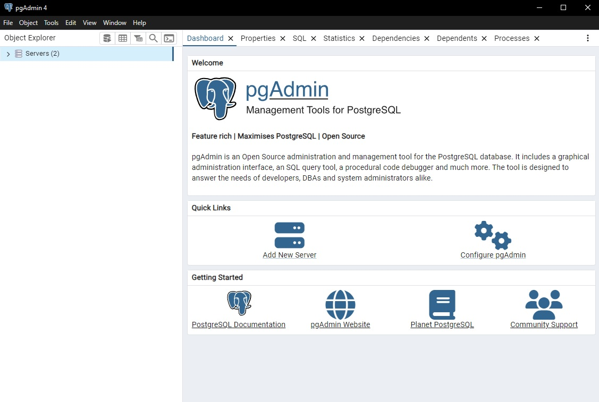
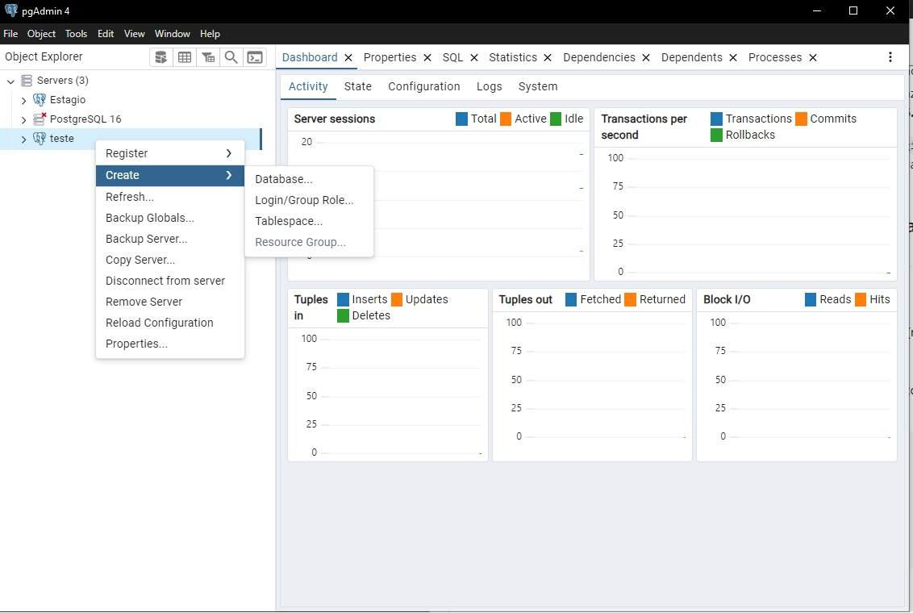
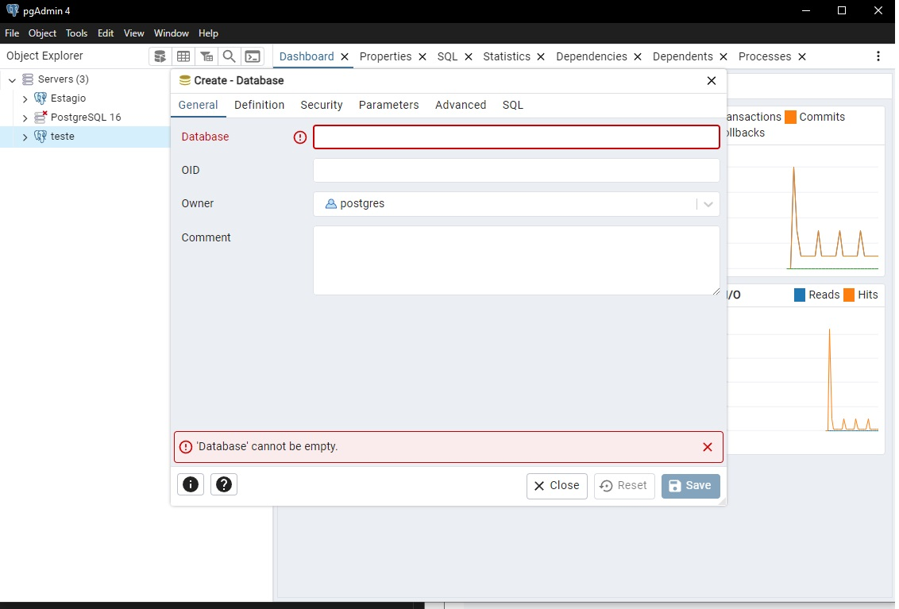
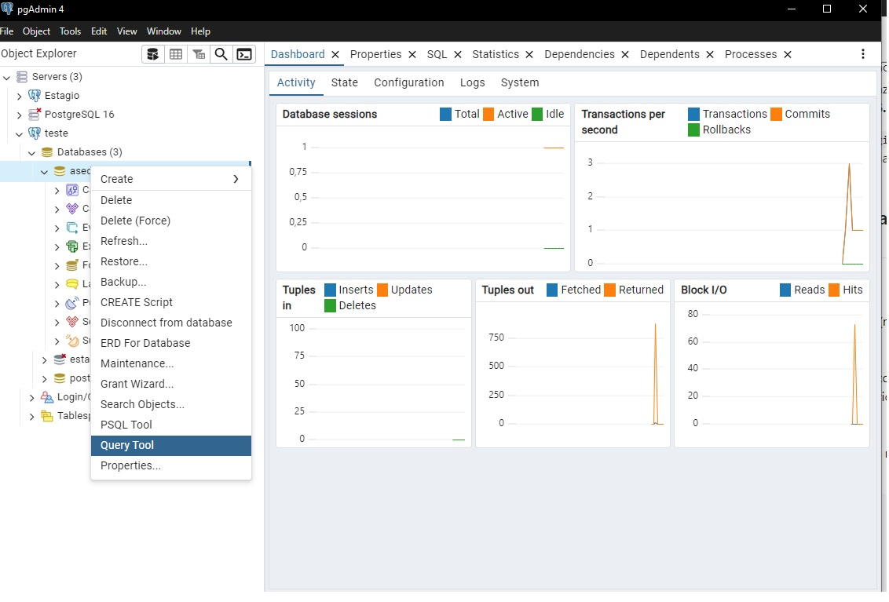

# Projeto Backend com Spring Boot - Passo a passo de como rodar o projeto

Este é um projeto backend desenvolvido em Spring Boot. Aqui descreverei passo a passo como rodar o projeto na máquina, tanto para desenvolver, quanto para ter as rotas disponíveis para serem consumidas.

## Pré-requisitos

Certifique-se de que você tenha as seguintes ferramentas instaladas em sua máquina:

- [Java 17](https://www.oracle.com/br/java/technologies/downloads/#jdk17-windows) -> Usamos **java 17** nesse projeto, então acesse esse link e navegue até JDK 17>Windows>x64 installer. ** Caso tenha dúvida se você possua o java, abra um terminal (cmd do windows) e execute "java --version", o que deve retornar a versão do Java.
- [PostgreSQL]("https://www.enterprisedb.com/downloads/postgres-postgresql-downloads") Nesse projeto usamos o banco de dados PostgreSQL. Para fazer testes com a API será necessário ter o SGBD instalado na máquina. Instale a **versão 16.4**!


## Configuração do Banco de Dados e criando uma tabela "Aluno"
1. Clone o projeto, caso ainda não tenha o feito. Faça isso usando o comando `git clone https://github.com/FRAN-SOLUTIONS/backend.git` na pasta que você deseja guardar o projeto, ou use o github desktop.
2. Com o Postgre instalado, Pesquise na barra de tarefas: pgAdmin 4.
3. Clique em "Add new server".

4. Entre com um nome para o servidor (não será importante para depois)
5. Mude para "connection" e coloque "localhost" em Hostname/Adress. Abaixo, entre com a senha e clique em salvar.
6. Na aba lateral esquerda, clique no servidor que criou com o botao direito dou mouse, navegue create>database.

7. Escolha um nome para sua database. Este vai ser necessário para declaração mais pra frente.

8. navegue até sua database, clique com botão direito e navegue até "Query tool"

9. Insira o seguinte código e rode-o para criar a tabela alunos: 


    ```sql
    CREATE TABLE aluno (
    id SERIAL PRIMARY KEY,
    nome VARCHAR(255) NOT NULL,
    email VARCHAR(255) NOT NULL UNIQUE,
    telefone VARCHAR(20),
    password TEXT NOT NULL
);
    

3. Feito a configuração no bdd, agora, no repositório backend, crie um arquivo chamado exatamente application.properties, neste caminho na pasta resources: `src/main/resources/application.properties` com as configurações do banco de dados:

    ```properties
    spring.datasource.url=jdbc:postgresql://localhost:5432/nome_database
    spring.datasource.username=postgres
    spring.datasource.password=minha_senha_secreta
    spring.datasource.driver-class-name=org.postgresql.Driver
    spring.jpa.properties.hibernate.dialect=org.hibernate.dialect.PostgreSQLDialect
    spring.jpa.hibernate.ddl-auto=update

    spring.jmx.enabled=false
    server.port=8082
    ```
Note que você deve colocar o nome da database que você criou lá no PostgreSQL. Da mesma forma, a sua senha que foi definida na instalação do PostgreSQL. Também é importante definir uma porta para o servidor do projeto projeto em `server.port`, pois a porta padrão 8080 é muito utilizada em outros serviços. 

4. Clique em "run java" para executar o projeto. Fique atento no terminal, para detectar qualquer possível erro. Se tudo der certo, agora você poderá acessar as rotas disponibilizadas pelos arquivos controladores no seu navegador ou no Swagger: http://localhost:8082/swagger-ui/index.html. Nessa página você poderá testar as rotas sem ter que ficar escrevendo no navegador toda hora, centralizando automaticamente todas as urls em uma única interface visual.


